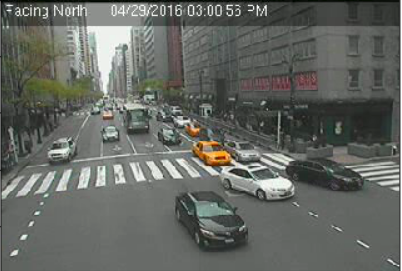

# Vehicle counting
Vehicle counting by density map regression.

## Installation
```
pip3 install requirements.txt
```

## CityCam dataset
Download the dataset from the link down below. Each car in the frames is annotated by a bounding box.  
[CityCam dataset](https://www.citycam-cmu.com/dataset)

## Density map
  
  
Gernally speaking, I put a gaussian kernel at the center of every car to generate a density map for a specific image frame. As for the standard deviation (sigma) of the gaussian kernel, it is determined by the sum of the distances to the k nearest neighbors. Please read this [MCNN paper](https://www.semanticscholar.org/paper/Single-Image-Crowd-Counting-via-Multi-Column-Neural-Zhang-Zhou/427d6d9bc05b07c85fc6b2e52f12132f79a28f6c) for more details. You could find my implementation over here [k_nearest_gaussian_kernel](https://github.com/MartinMa28/vehicle_counting/blob/master/density_map/k_nearest_gaussian_kernel.py).